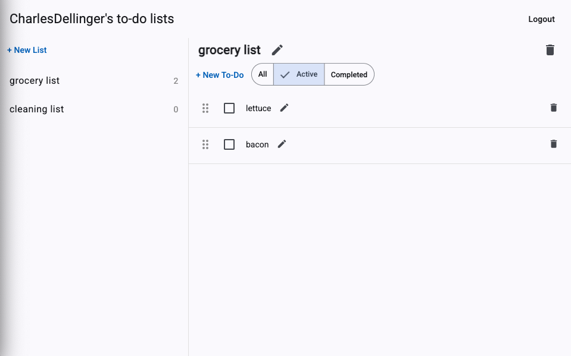
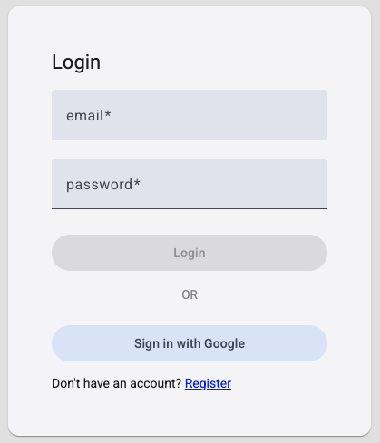

# Todo App — Angular + .NET Entity Framework

A full-stack todo list application with Angular frontend and .NET 9 backend.

**Live:** https://todo.charlesdellinger.com



## Features

- Multiple todo lists per user
- Drag-and-drop persistent reorder
- Active/Completed/All filter toggle
- Inline editing for list names, item titles, and descriptions
- Responsive Material Design UI
- Google OAuth and email/password authentication



## Tech Stack

### Frontend
- Angular 19 with standalone components
- Angular Material for UI
- Angular CDK for drag-and-drop
- Signals for reactive state management
- Reactive Forms with validation

### Backend
- .NET 9 / ASP.NET Core Web API
- Entity Framework Core with SQL Server
- ASP.NET Identity with JWT Bearer authentication
- Google OAuth 2.0
- Clean Architecture (Core → Infrastructure → API)

### Deployment
- **Frontend:** Azure Static Web Apps
- **Backend:** Azure App Service (F1 free tier)
- **Database:** Azure SQL Database (free tier)

## Architecture

```
backend/
  Core/            # Domain entities, interfaces, DTOs
  Infrastructure/  # EF DbContext, repositories, Identity config
  API/             # Controllers, middleware, Program.cs

frontend/
  src/app/
    core/          # Services, interceptors, guards, models
    features/
      auth/        # Login, register components
      todo/        # Dashboard, list page, list detail, item components
```

## API Endpoints

| Method | Route | Purpose |
|--------|-------|---------|
| POST | `/api/auth/register` | Register new user |
| POST | `/api/auth/login` | Login with email/password |
| GET | `/api/auth/me` | Get current user |
| GET | `/api/auth/google-login` | Initiate Google OAuth |
| GET/POST | `/api/todolists` | List all / Create |
| GET/PUT/DELETE | `/api/todolists/{id}` | Single list CRUD |
| POST | `/api/todolists/{listId}/items` | Add item to list |
| PUT/DELETE | `/api/items/{id}` | Update/delete item |
| PUT | `/api/todolists/{listId}/reorder` | Persist item sort order |